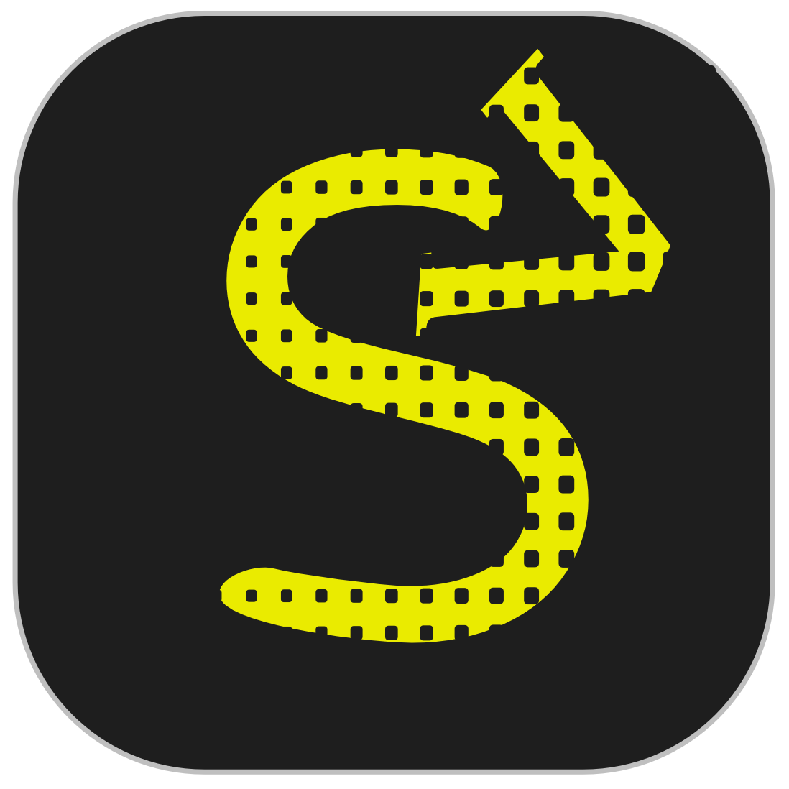
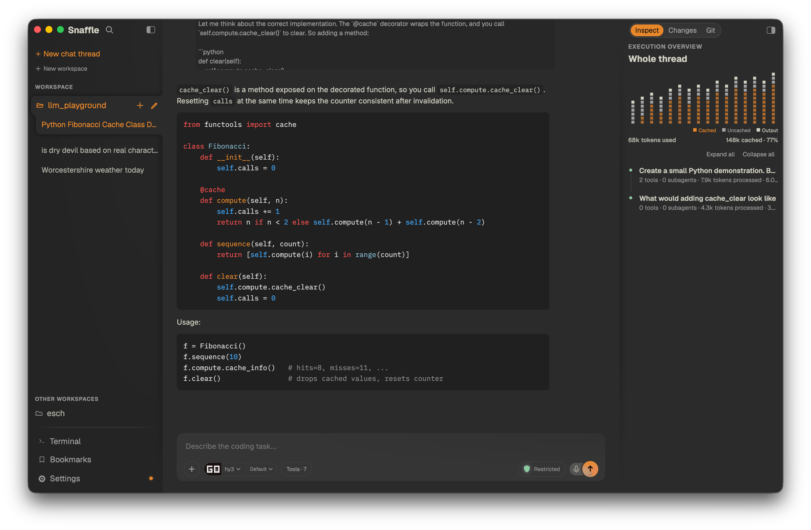
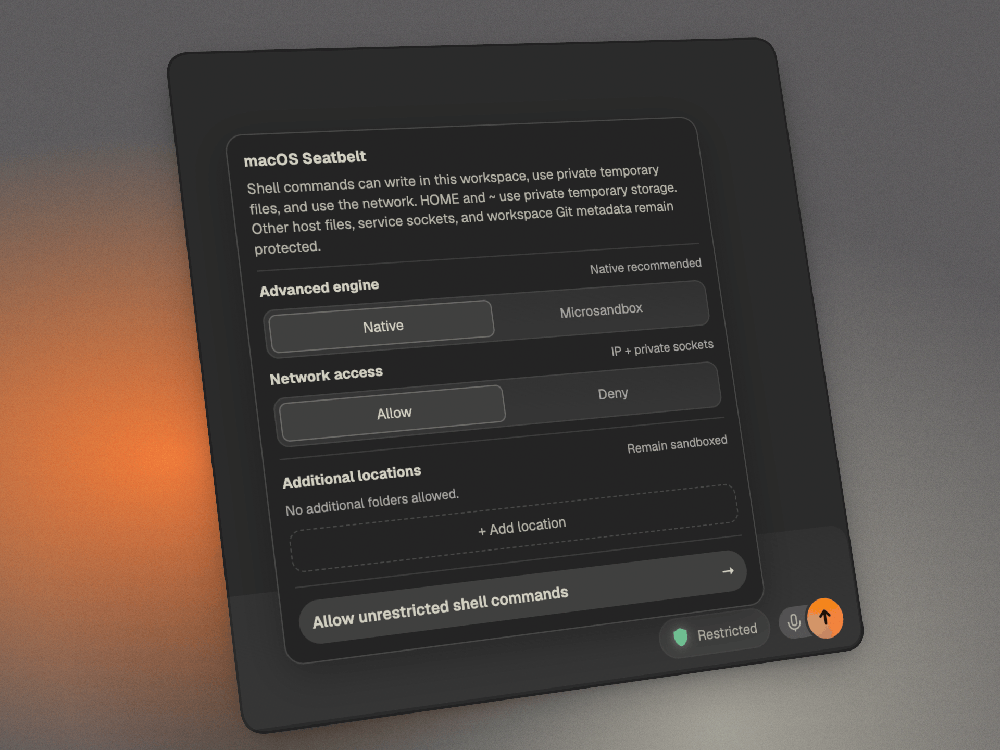
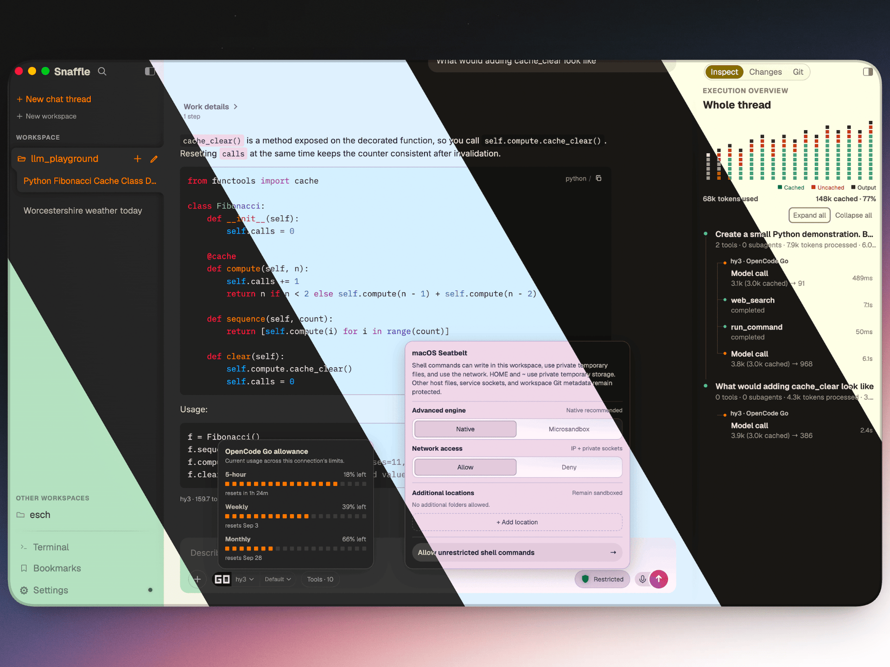
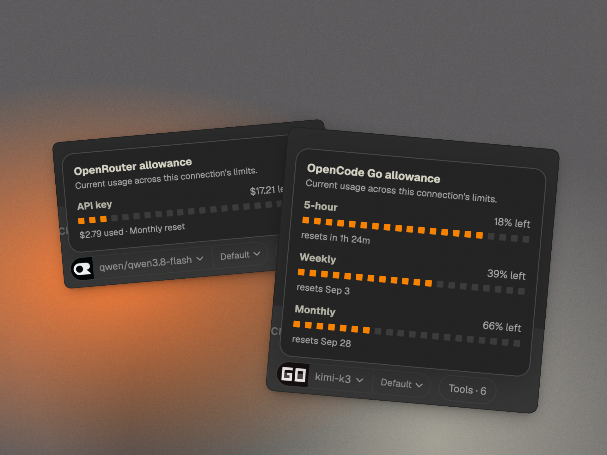

  

<h1 align="center">Snaffle</h1>

  <strong>A coding harness with two first-class citizens.</strong> 
  Models get a small, predictable surface, while Snaffle gives you full transparency and control.

  

Inspired by [Pi](https://pi.dev/)'s small model-surface philosophy, Snaffle starts with five focused coding tools plus planning inside a full-featured desktop app. Optional capabilities stay under your control, while built-in sandboxing, rich inspection, and deep customization keep the experience powerful and safe.

<table>
  <tr>
    <td width="58%" valign="middle">
      
    </td>
    <td width="42%" valign="middle">
      <h2>Sandboxed by default</h2>
      

        A rich, easy-to-use interface puts you in control of what the model can access. Run shell commands with guardrails and grant extra folders only when a task needs them.
      

      <ul>
        <li><strong>macOS:</strong> Seatbelt by default; Microsandbox optional.</li>
        <li><strong>Linux:</strong> Bubblewrap by default; Microsandbox optional.</li>
        <li><strong>Windows:</strong> Microsandbox support is experimental.</li>
      </ul>
    </td>
  </tr>
</table>

<table>
  <tr>
    <td width="34%" valign="middle">
      <h2>Easy to customize</h2>
      

        Choose a theme, tune conversation and code typography, and adjust the interface to fit the way you work. Keep long sessions comfortable and easy to read.
      

    </td>
    <td width="66%" valign="middle">
      
    </td>
  </tr>
</table>

<table>
  <tr>
    <td width="58%" valign="middle">
      
    </td>
    <td width="42%" valign="middle">
      <h2>Quota at a glance</h2>
      

        Click the provider icon to stay ahead of your quota on supported providers like OpenCode Go and OpenRouter.
      

    </td>
  </tr>
</table>

## And more

- **Designed for local models out of the box.** Just five focused coding tools, bounded output, durable planning, and optional capabilities only when they are invited in.
- **Transparent execution.** See the model's full input and output, active tool surface, tool calls, context, and execution details.
- **Provider overflow.** Keep working when local inference capacity is occupied by routing delegated overflow to another provider while the main conversation stays on its selected model.
- **Image understanding fallback.** Text-only models can automatically route images to a separately configured vision model without changing the main conversation model.
- **Built from the ground up as a desktop application.**
- **Advanced features when you need them.** Web access, subagents, skills, and MCP stay out of ordinary model requests until activated.
- **Great OpenRouter and DeepSeek support out of the box.** Model discovery, provider-specific controls, and useful defaults are built in.

## Status

Snaffle is working pre-v1 software. It has not yet been tested on Windows.
